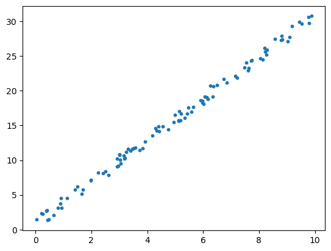

<div class="notice--success">
<h4>Python_Basic 학습 순서</h4>
<ul>
    <li>1. 파이썬 기초 및 데이터 처리</li>
    <li>2. 파이썬 기초 및 데이터 수집</li>
    <li>3. 파이썬 크롤링</li>
    <li>4. 파이썬 api</li>
</ul>
</div>

## 소개

안녕하세요 인공지능 개발자를 지망하는 윤동민입니다. 지금까지 파이썬 데이터 처리와 크롤링 등은 많이 해봤지만, 머닝러신, 딥러닝 쪽은 이론 공부만 해봤지 실제 구현은 해본적이 없습니다. 때문에 이번기회에 지금까지 배운것을 쭉 정리하고, 인공지능을 공부해 볼려고 합니다. 지금은 부족하지만, 앞으로 성장해가는 모습을 보여드리겠습니다.

## 개요

여러 카테고리를 만들어 파이썬과 인공지능에 대해 공부해 나갈 겁니다. 이 중 python_basic는 지금까지 제가 배운 내용을 정리해서 복습하는 기회로 소개해드리겠습니다.

## 파이썬 기초 데이터처리 기술(1)

1. 머닝러신 기초(2)
2.
3.

#### 1. 머닝러신 기초(2)

```python
# 1. 데이터 준비
import pandas as pd
import numpy as np
import matplotlib as mpl
import matplotlib.pyplot as plt
import seaborn as sns
```

```python
print("pd ver = ", pd.__version__)
print("np ver = ", np.__version__)
print("mpl ver = ", mpl.__version__)
print("sns ver = ", sns.__version__)
```

    pd ver =  1.4.4
    np ver =  1.21.5
    mpl ver =  3.5.2
    sns ver =  0.11.2

```python
rs = np.random.RandomState(10)
x = 10 * rs.rand(100)
y = 3 * x + 2 * rs.rand(100)

plt.scatter(x,y, s= 10)
```

    <matplotlib.collections.PathCollection at 0x268b3b1edc0>



```python
# 2. 모델 클래스 선택
from sklearn.linear_model import LinearRegression
# 3. 모델 인스턴스 생성 & 하이퍼파라미터 선택
regr = LinearRegression()
regr_01 = LinearRegression(fit_intercept=False)
```

```python
# 4. 특징 행렬과 대상 벡터 준비
X = x.reshape(-1,1)
X.shape, y.shape
```

    ((100, 1), (100,))

```python
# 5. 모델을 데이터에 적합
regr.fit(X,y)
```

    LinearRegression()

```python
regr_01.fit(X,y)
```
