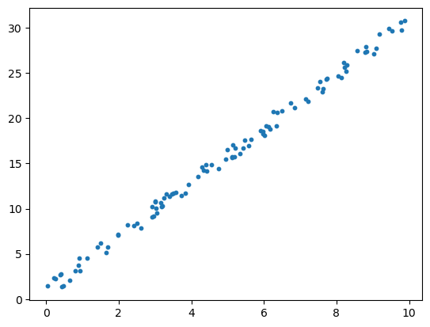

<div class="notice--success">
<h4>Python_Basic 학습 순서</h4>
<ul>
    <li>1. 파이썬 기초 및 데이터 처리</li>
    <li>2. 파이썬 기초 및 데이터 수집</li>
    <li>3. 파이썬 크롤링</li>
    <li>4. 파이썬 api</li>
</ul>
</div>

## 소개

안녕하세요 인공지능 개발자를 지망하는 윤동민입니다. 지금까지 파이썬 데이터 처리와 크롤링 등은 많이 해봤지만, 머닝러신, 딥러닝 쪽은 이론 공부만 해봤지 실제 구현은 해본적이 없습니다. 때문에 이번기회에 지금까지 배운것을 쭉 정리하고, 인공지능을 공부해 볼려고 합니다. 지금은 부족하지만, 앞으로 성장해가는 모습을 보여드리겠습니다.

## 개요

여러 카테고리를 만들어 파이썬과 인공지능에 대해 공부해 나갈 겁니다. 이 중 python_basic는 지금까지 제가 배운 내용을 정리해서 복습하는 기회로 소개해드리겠습니다.

## 파이썬 기초 데이터처리 기술(1)

1. 머닝러신 기초(2)
2. 머닝러신 와인값예측
3. iris 모델 만들기
4. zoo 모델 만들기

#### 1. 머닝러신 기초(2)

```python
# 1. 데이터 준비
import pandas as pd
import numpy as np
import matplotlib as mpl
import matplotlib.pyplot as plt
import seaborn as sns
```

```python
print("pd ver = ", pd.__version__)
print("np ver = ", np.__version__)
print("mpl ver = ", mpl.__version__)
print("sns ver = ", sns.__version__)
```

    pd ver =  1.4.4
    np ver =  1.21.5
    mpl ver =  3.5.2
    sns ver =  0.11.2

```python
rs = np.random.RandomState(10)
x = 10 * rs.rand(100)
y = 3 * x + 2 * rs.rand(100)

plt.scatter(x,y, s= 10)
```

    <matplotlib.collections.PathCollection at 0x268b3b1edc0>



```python
# 2. 모델 클래스 선택
from sklearn.linear_model import LinearRegression
# 3. 모델 인스턴스 생성 & 하이퍼파라미터 선택
regr = LinearRegression()
regr_01 = LinearRegression(fit_intercept=False)
```

```python
# 4. 특징 행렬과 대상 벡터 준비
X = x.reshape(-1,1)
X.shape, y.shape
```

    ((100, 1), (100,))

```python
# 5. 모델을 데이터에 적합
regr.fit(X,y)
```

    LinearRegression()

```python
regr_01.fit(X,y)
```

#### 2. 머신러닝 와인값예측

### (실습)

1. 데이터셋 와인데이터셋 푸밀 모델 만들기
   - 레드와인, 화이트와인
2. 입력변수 12
3. 출력변수 1개 -> 1~10점 품질을 예측하는 모델 만들기
4. LinearRegression
5. fit_intercept = True

```python
import numpy as np
import pandas as pd
import matplotlib.pyplot as plt
import seaborn as sns
```

```python
redwine = pd.read_csv("https://archive.ics.uci.edu/ml/machine-learning-databases/wine-quality/winequality-red.csv",
                      sep=";", header=0)
redwine["type"] = "red"

whitewine = pd.read_csv("https://archive.ics.uci.edu/ml/machine-learning-databases/wine-quality/winequality-white.csv",
                      sep=";", header=0)
whitewine["type"] = "white"

wine = redwine.append(whitewine)
wine.columns = wine.columns.str.replace(" ", "_")
```

    C:\Users\ehdal\AppData\Local\Temp\ipykernel_30952\2270915795.py:9: FutureWarning: The frame.append method is deprecated and will be removed from pandas in a future version. Use pandas.concat instead.
      wine = redwine.append(whitewine)

```python
import sklearn
print(sklearn.__version__)
```

    1.0.2

```python
from sklearn.linear_model import LinearRegression
lr = LinearRegression(fit_intercept=True)
lr
```

    LinearRegression()

```python
X = wine.drop(["type", "quality"], axis=1)
y = wine.quality
```

```python
from sklearn.model_selection import train_test_split

X_train, X_test, y_train, y_test = train_test_split(X, y, random_state=1)
```

```python
lr.fit(X_train, y_train)
```

    LinearRegression()

```python
new_data = [[8.3, 0.3, 0.2, 2.5, 0.1, 21, 46.5, 0.8, 3.3, 0.6, 9.5],
            [6.3, 0.3, 0.34, 1.6, 0.5, 14, 132, 0.9, 3.3, 0.49, 9.5]]
lr.predict(new_data)
```

    C:\Users\ehdal\anaconda3\lib\site-packages\sklearn\base.py:450: UserWarning: X does not have valid feature names, but LinearRegression was fitted with feature names
      warnings.warn(


    array([16.03655426, 10.07640498])

```python

```

#### 3. iris 모델

```python
### ( iris 모델 만들기 )
from sklearn.linear_model import LogisticRegression
from sklearn.datasets import load_iris
from sklearn.model_selection import train_test_split
from sklearn.metrics import accuracy_score

X, y = load_iris(return_X_y=True) # 데이터 셋

lr = LogisticRegression(random_state=0)

# train and test set 만들기
X_train, X_test, y_train, y_test = train_test_split(X, y,train_size= 0.85,
                                                    random_state=123)

lr.fit(X_train, y_train) # fit

accuracy_score(lr.predict(X_test),y_test ) # test 데이터 예측 결과 채점
```

    C:\Users\ehdal\anaconda3\lib\site-packages\sklearn\linear_model\_logistic.py:814: ConvergenceWarning: lbfgs failed to converge (status=1):
    STOP: TOTAL NO. of ITERATIONS REACHED LIMIT.

    Increase the number of iterations (max_iter) or scale the data as shown in:
        https://scikit-learn.org/stable/modules/preprocessing.html
    Please also refer to the documentation for alternative solver options:
        https://scikit-learn.org/stable/modules/linear_model.html#logistic-regression
      n_iter_i = _check_optimize_result(


    1.0

```python
new_data = [[1.5, 1.3, 1.7, 1.6]]
rfc.predict(new_data) # 모델 확정후 실 데이터 적용
```

    ---------------------------------------------------------------------------

    NameError                                 Traceback (most recent call last)

    ~\AppData\Local\Temp\ipykernel_44772\4135739537.py in <module>
          1 new_data = [[1.5, 1.3, 1.7, 1.6]]
    ----> 2 rfc.predict(new_data) # 모델 확정후 실 데이터 적용


    NameError: name 'rfc' is not defined

```python

```

    ---------------------------------------------------------------------------

    NameError                                 Traceback (most recent call last)

    ~\AppData\Local\Temp\ipykernel_44772\4135739537.py in <module>
          1 new_data = [[1.5, 1.3, 1.7, 1.6]]
    ----> 2 rfc.predict(new_data) # 모델 확정후 실 데이터 적용


    NameError: name 'rfc' is not defined

### ( iris 데이터셋으로 모델 만들기 )

1. RandomForestClassifier 모델 적용
2. Train_test_split 70 vs 30
3. 모델 만들기
4. 모델로 다음과 같은 측정된 붓꽃 품종 예측 하기
   - setosa(0) versicolor(1), virginical(2)
5. sepal_length (5.8), sepal_width(3.5), petal_length(3.7), petal_width(1.2)
   - 출력 결과 -> 해당 품종은 = versicolor 입니다

```python
from sklearn.ensemble import RandomForestClassifier
from sklearn.datasets import load_iris
from sklearn.model_selection import train_test_split

# 데이터 셋
iris = load_iris()
X = iris.data
y = iris.target

# 모델 선정
clf = RandomForestClassifier(random_state=0)

# 데이터셋 나누기
X_train, X_test, y_train, y_test = train_test_split(X, y, test_size=0.3, random_state=250)

clf.fit(X_train, y_train)
y_pred = clf.predict(X_test)

from sklearn.metrics import accuracy_score
accuracy_score(y_test, y_pred)
```

    0.9333333333333333

```python
clf.score(X_test, y_test)
```

    0.9333333333333333

```python
y_pred
```

    array([1, 2, 0, 1, 2, 0, 1, 1, 1, 0, 0, 2, 0, 2, 1, 0, 0, 2, 0, 1, 1, 2,
           2, 1, 2, 0, 0, 0, 2, 1, 1, 1, 0, 1, 1, 1, 2, 0, 0, 1, 1, 1, 1, 0,
           0])

```python
new_data = [[5.8, 3.5, 3.7, 1.2]]
res = clf.predict(new_data)

species = ["setosa","versicolor","virginica"]

print("해당 품종은 = ", species[res[0]], " 입니다")
```

    해당 품종은 =  versicolor  입니다

```python
clf.score(X_test, y_test)
```

    0.9333333333333333

```python

```

#### 4. zoo 모델 만들기

### ( zoo 모델 만들기 ) (분류 모델)

1. 데이터 셋
   - https://archive.ics.uci.edu/ml/datasets/zoo
2. RandomForestClassifier 모델 적용
3. Train vs test 데이터는 7 vs 3
4. 모델 훈련
5. 모델 측정
6. 신규 데이터 -> 1,0,0,1,0,0,0,1,1,1,0,0,4,1,0,0
   - 출력 -> 해당 타입은 ? 입니다.
   - type은 1~7 사이

```python
# 1. 데이터 준비
import pandas as pd
url = "https://archive.ics.uci.edu/ml/machine-learning-databases/zoo/zoo.data"
zoo = pd.read_csv(url, header=None)

x = zoo.drop([0,17], axis=1)
y = zoo[17]

# 2. 모델 클래스 선택과 인스턴스 생성
from sklearn.ensemble import RandomForestClassifier

# 3. 인스턴스 생성
rfc = RandomForestClassifier(random_state=0)

# 4. Train test 7v3
from sklearn.model_selection import train_test_split
x_train, x_test, y_train, y_test = train_test_split(x, y,
                                                   test_size=0.3, random_state=0)

# 5. 모델 데이터에 적합(훈련)
rfc.fit(x_train, y_train)

# 6. 테스트 데이터로 예측
y_pred = rfc.predict(x_test)

# 7. 평가하기
from sklearn.metrics import accuracy_score
accuracy_score(y_pred, y_test)

new_data = [[1,0,0,1,0,0,0,1,1,1,0,0,4,1,0,0]]
res = rfc.predict(new_data)
print("해당 타입은 =", res[0], "입니다.")
```

    해당 타입은 = 1 입니다.

```python

```

```python

```

```python

```
